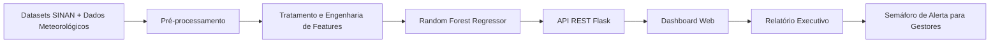
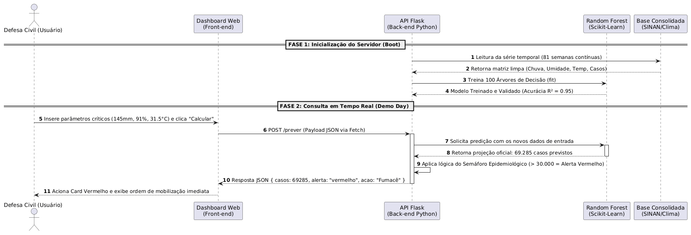

# PrevDengue

Sistema inteligente de apoio à tomada de decisão para previsão de surtos de dengue baseado em técnicas de Machine Learning e análise de variáveis meteorológicas. O projeto foi desenvolvido como **Minimum Viable Product (MVP)** durante o programa **Rocket de Férias** da **FPFtech Escola Tecnológica**, propondo uma arquitetura preditiva capaz de apoiar órgãos de saúde pública e defesa civil na antecipação de cenários epidemiológicos.

---

# Visão Geral

O **PrevDengue** consiste em uma plataforma preditiva que integra dados epidemiológicos do **SINAN (Sistema de Informação de Agravos de Notificação)** com informações climáticas para estimar a quantidade de notificações de dengue em semanas epidemiológicas futuras.

A solução utiliza modelos supervisionados de regressão para identificar padrões entre condições meteorológicas e a incidência da doença, permitindo que gestores públicos planejem ações preventivas antes do aumento expressivo de casos.

Entre as principais aplicações encontram-se:

- Planejamento de campanhas preventivas;
- Apoio à alocação de equipes de vigilância epidemiológica;
- Dimensionamento de recursos hospitalares;
- Planejamento de operações de controle vetorial;
- Apoio à tomada de decisão baseada em dados.

---

# Contexto do Projeto

O projeto foi desenvolvido durante o **Rocket de Férias**, programa de imersão tecnológica promovido pela **FPFtech Escola Tecnológica**, como parte das atividades de Hackathon e Demo Day.

O desafio consistiu na construção de um MVP funcional capaz de aplicar técnicas de Ciência de Dados, Engenharia de Software e Machine Learning para solucionar um problema real de saúde pública utilizando dados históricos e variáveis ambientais.

---

# Arquitetura da Solução

A arquitetura foi projetada seguindo o princípio de separação de responsabilidades entre processamento analítico e camada de apresentação.

- **Back-end:** responsável pelo processamento dos dados, treinamento do modelo de Machine Learning e disponibilização da API REST.
- **Front-end:** responsável pela visualização das previsões, gráficos estatísticos e interação com o usuário.
- **Artefatos:** armazenamento de datasets processados e produtos gerados pelo pipeline analítico.

---

## Pipeline da Solução



---

## Diagrama de Sequência

O diagrama abaixo representa o fluxo completo de comunicação entre a interface Web, a API Flask e o modelo preditivo durante uma solicitação de previsão.

<p align="center">

</p>

---

# Arquitetura dos Componentes

```text
                        Front-end
                  HTML • CSS • JavaScript
                            │
                            ▼
                    Requisições HTTP
                            │
                            ▼
                     API REST (Flask)
                            │
             ┌──────────────┴──────────────┐
             ▼                             ▼
     Pré-processamento             Modelo Random Forest
             │                             │
             └──────────────┬──────────────┘
                            ▼
                     Predição de Casos
                            │
                            ▼
                Dashboard e Relatório PDF
```

---

# Pilha Tecnológica

## Back-end

- Python
- Flask
- Flask-CORS
- Pandas
- NumPy
- Scikit-Learn

## Machine Learning

- Random Forest Regressor

## Front-end

- HTML5
- CSS3
- JavaScript (ES6+)
- Chart.js

## Geração de Relatórios

- jsPDF

## Ferramentas Auxiliares

- Matplotlib
- Git
- GitHub

---

# Metodologia de Machine Learning

O núcleo analítico do PrevDengue foi desenvolvido utilizando técnicas de aprendizado supervisionado para modelar relações não lineares entre fatores meteorológicos e a incidência histórica de dengue.

## Modelo Utilizado

O algoritmo adotado foi o **Random Forest Regressor**, disponibilizado pela biblioteca **Scikit-Learn**.

A escolha ocorreu devido às seguintes características:

- elevada capacidade de generalização;
- robustez contra overfitting;
- boa interpretação estatística;
- capacidade de modelar relações não lineares;
- desempenho consistente em problemas de regressão multivariada.

---

## Pipeline de Dados

O processo analítico é composto pelas seguintes etapas:

1. Importação dos registros históricos do SINAN;
2. Integração com dados meteorológicos;
3. Limpeza e tratamento das informações;
4. Construção das variáveis de entrada;
5. Treinamento do modelo;
6. Inferência sob demanda através da API Flask.

---

## Validação Estatística

O desempenho do modelo foi avaliado utilizando métricas de regressão.

**Coeficiente de Determinação**

```text
R² = 0.89
```

O resultado demonstra elevada capacidade do modelo em explicar a variabilidade dos dados históricos utilizados durante o treinamento.

---

# Dicionário das Variáveis Climáticas

As previsões são fundamentadas em três variáveis meteorológicas que influenciam diretamente o ciclo biológico do vetor *Aedes aegypti*.

| Variável | Unidade | Impacto Biológico |
|----------|---------|-------------------|
| Volume de Chuva | mm | Favorece a formação de criadouros e reservatórios de água parada para oviposição. |
| Umidade Relativa | % | Aumenta a sobrevivência, longevidade e dispersão do mosquito adulto. |
| Temperatura Média | °C | Acelera o metabolismo do vetor, reduz o ciclo de desenvolvimento e favorece a replicação viral. |

---

# Estrutura do Projeto

```text
PREVDENGUE-MACHINELEARNING/
│
├── backend/
│   │
│   ├── artefatos/
│   │   ├── dados_clima_dengue.csv
│   │   └── grafico_dengue.png
│   │
│   ├── dataset/
│   │   ├── DENGBR25.csv
│   │   └── DENGBR26.csv
│   │
│   └── scripts/
│       ├── api.py
│       ├── gerar_grafico.py
│       ├── modelo_preditivo.py
│       └── processar_sinan.py
│
├── docs/
│   └── Diagrama-Sequencia.png
│
├── frontend/
│   ├── index.html
│   ├── script.js
│   └── style.css
│
├── requirements.txt
├── .gitignore
└── README.md
```

---

# Guia de Instalação

## Clonar o Repositório

```bash
git clone https://github.com/seu-usuario/PREVDENGUE-MACHINELEARNING.git

cd PREVDENGUE-MACHINELEARNING
```

---

## Instalar Dependências

```bash
pip install -r requirements.txt
```

ou

```bash
pip install flask flask-cors pandas numpy scikit-learn matplotlib
```

---

## Inicializar a API

```bash
cd backend/scripts

python api.py
```

Após a inicialização, a API estará disponível em:

```text
http://127.0.0.1:5000/prever
```

Durante a inicialização são executadas automaticamente as seguintes etapas:

- carregamento dos datasets;
- tratamento dos dados;
- treinamento do modelo Random Forest;
- disponibilização da API REST.

---

## Executar a Interface Web

Abra o arquivo:

```text
frontend/index.html
```

ou utilize uma extensão como **Live Server** no Visual Studio Code.

---

# Organização dos Componentes

| Diretório | Responsabilidade |
|------------|------------------|
| backend/dataset | Bases de dados epidemiológicas originais |
| backend/artefatos | Dados tratados e gráficos gerados |
| backend/scripts | Pipeline de processamento, treinamento e API |
| frontend | Dashboard Web |
| docs | Diagramas e documentação técnica |

---

# Objetivo Técnico

Demonstrar a aplicação integrada de Engenharia de Software, Ciência de Dados e Machine Learning no desenvolvimento de um sistema preditivo para apoio à tomada de decisão em saúde pública, utilizando uma arquitetura modular baseada em API REST e modelos supervisionados de regressão.

---

# Competências Demonstradas

O desenvolvimento deste projeto evidencia conhecimentos práticos em:

- Engenharia de Software;
- Arquitetura de Sistemas;
- Ciência de Dados;
- Machine Learning;
- Engenharia de Features;
- Desenvolvimento de APIs REST;
- Desenvolvimento Web Full Stack;
- Visualização de Dados;
- Integração entre Back-end e Front-end;
- Processamento e tratamento de dados epidemiológicos.

---

# Licença

Este projeto foi desenvolvido exclusivamente para fins acadêmicos e demonstração técnica durante o programa Rocket de Férias da FPFtech Escola Tecnológica.
````
